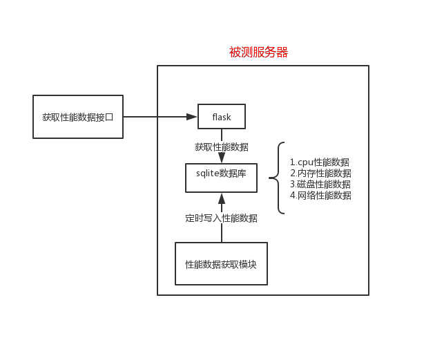

# ServerPerformanceMonitor

#### 介绍
服务端性能监控工具
结构图  


#### 使用说明

##### 1. 在被测服务器上启动api_server 
```python
python api_server.py
```
   
##### 2. 调用接口获取服务端性能数据  
接口说明:  

GET /server/performance  

 >请求参数：

| 参数名     | 值类型   | 说明   | 必填   | 示例  |
| --------   | -----:   |-----:  | -----: | :----: |
| start_timestamp   | int   |开始时间戳  |   是   |1559919459|
| end_timestamp   | int   |结束时间戳    |   是   |1559919649|  

>请求示例：  
```python
GET http://<host>:<port>/server/performance?start_timestamp=1559919459&end_timestamp=1559919649
```

>响应body：

| 参数名     | 值类型   | 说明   | 必填   | 示例  |
| --------   | -----:   |-----:  | -----: | :----: |
| code       | int      |业务码  |   是   |0|
| msg        | string   |信息    |   是   |"success"| 
| data       | object   |数据    |   是   |见示例...|

>响应示例：  
```python
{
    #业务码,int类型
    "code": 0,       
    #信息,string类型
    "msg": "success",
    #返回数据,json类型
    "data": {
        # cpu占用率
        "CpuUsage": {
            # 平均值
            "Avg": 5.27,
            # 最大值
            "Max": 39.5,
            # 最小值
            "Min": 3
        },
        # 内存占用率
        "MemUsage": {
            # 平均值
            "Avg": 56.64,
            # 最大值
            "Max": 56.85,
            # 最小值
            "Min": 56.15
        }
    }
}
```